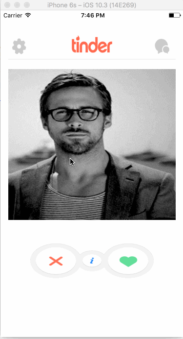

## Basic Tinder App

## User Stories

This app has the following functionalities:

- [X] User can swipe left and right.
- [X] User can see the profile when clicked on the image.
- [X] Dismiss the profile view when done is pressed.
- [X] Retains the original location when left between left or right swipe.

Here's a walkthrough of implemented user stories:

GIF created with [LiceCap](http://www.cockos.com/licecap/).

